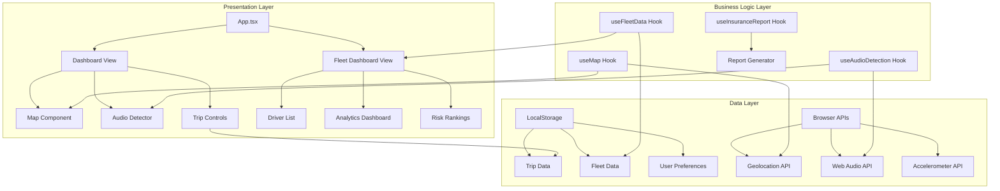
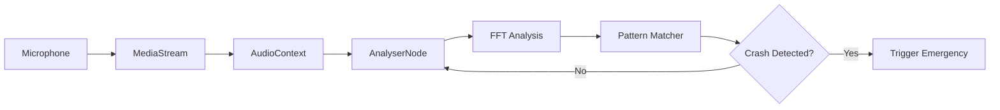

# Design Document: Advanced Safety Features

## Overview

This design document specifies the technical architecture for implementing advanced safety features in the SmartSafe road safety application. The features extend the existing GPS tracking, accelerometer-based crash detection, and safety scoring capabilities with:

- **Live Map Display**: Interactive mapping with real-time location tracking, accident zone visualization, POI markers, and speed overlays
- **Audio-Based Crash Detection**: Web Audio API integration for detecting crashes through sound pattern analysis
- **Fleet Management**: Multi-driver dashboard with risk ranking, trip analytics, and administrative controls
- **Insurance Reporting**: Automated report generation system for insurance submissions

### Design Goals

1. **Seamless Integration**: Extend existing React 19 + TypeScript architecture without breaking changes
2. **Performance**: Maintain 30+ FPS for map rendering and real-time updates
3. **Privacy**: Implement audio detection without persistent recording
4. **Scalability**: Support fleet management for multiple drivers with efficient data synchronization
5. **User Experience**: Provide intuitive interfaces for both drivers and fleet administrators

### Technology Stack

- **Frontend**: React 19, TypeScript, Vite
- **Styling**: Tailwind CSS 4
- **Animation**: Motion (Framer Motion)
- **Icons**: Lucide React
- **Mapping**: Leaflet with React-Leaflet (chosen over Mapbox for open-source flexibility and no API key requirements)
- **Audio Processing**: Web Audio API (native browser API)
- **State Management**: React Context API for fleet data, existing useState for component state
- **Data Persistence**: LocalStorage for client-side data, future backend integration ready

## Architecture

### High-Level Architecture



### Component Hierarchy

```
App.tsx
├── WelcomeView (existing)
├── LoginView (existing)
├── DashboardView (existing, enhanced)
│   ├── MapComponent (new)
│   │   ├── AccidentZoneLayer
│   │   ├── POIMarkers
│   │   ├── SpeedOverlay
│   │   └── CurrentLocationMarker
│   ├── AudioDetectionIndicator (new)
│   ├── TripControlPanel (existing)
│   ├── MonitoringGrid (existing)
│   └── SafetyTips (existing)
└── FleetDashboardView (new)
    ├── FleetHeader
    ├── DriverList
    │   └── DriverCard
    ├── FleetAnalytics
    │   ├── AggregateMetrics
    │   └── TrendCharts
    ├── RiskRankingPanel
    └── DriverDetailModal
        ├── TripHistory
        ├── SafetyScoreTrend
        └── InsuranceReportGenerator
```

### State Management Strategy

**Component-Level State (useState)**:
- UI interactions (modals, dropdowns, toggles)
- Form inputs
- Loading states

**Context-Based State (React Context)**:
- Fleet data (drivers, trips, analytics)
- User authentication and role (driver vs admin)
- Audio detection settings

**Custom Hooks**:
- `useMap`: Map initialization, layer management, marker updates
- `useAudioDetection`: Audio stream processing, crash detection logic
- `useFleetData`: Fleet data fetching, synchronization, caching
- `useInsuranceReport`: Report generation, export formatting

## Components and Interfaces

### 1. MapComponent

**Purpose**: Display interactive map with real-time location, accident zones, POIs, and speed overlay.

**Technology Choice**: Leaflet + React-Leaflet
- **Rationale**: Open-source, no API keys required, extensive plugin ecosystem, excellent performance, smaller bundle size than Mapbox GL JS
- **Trade-offs**: Mapbox offers better vector tile rendering and 3D capabilities, but Leaflet is sufficient for 2D mapping needs and more cost-effective

**Props Interface**:
```typescript
interface MapComponentProps {
  center: [number, number];
  zoom: number;
  currentLocation: GeolocationCoordinates | null;
  speed: number;
  accidentZones: AccidentZone[];
  pois: POI[];
  showSpeedOverlay: boolean;
  speedLimit?: number;
  onZoneEnter?: (zone: AccidentZone) => void;
}
```

**Key Features**:
- Tile caching for offline support
- Custom markers for current location
- Colored overlays for accident zones
- Filterable POI markers
- Speed overlay with warning colors
- Pan and zoom controls

**Implementation Details**:
```typescript
// Map initialization with Leaflet
const map = L.map('map', {
  center: [lat, lng],
  zoom: 13,
  zoomControl: true,
  attributionControl: false
});

// Tile layer with caching
L.tileLayer('https://{s}.tile.openstreetmap.org/{z}/{x}/{y}.png', {
  maxZoom: 19,
  attribution: '© OpenStreetMap'
}).addTo(map);
```

### 2. AudioDetectionSystem

**Purpose**: Analyze audio input for crash detection using Web Audio API.

**Architecture**:


**Hook Interface**:
```typescript
interface UseAudioDetectionReturn {
  isActive: boolean;
  isPermissionGranted: boolean;
  sensitivity: 'low' | 'medium' | 'high';
  isCrashDetected: boolean;
  requestPermission: () => Promise<void>;
  setSensitivity: (level: 'low' | 'medium' | 'high') => void;
  testDetection: () => void;
}
```

**Detection Algorithm**:
1. **Frequency Analysis**: Monitor 100-500 Hz range (typical crash sounds)
2. **Amplitude Threshold**: Detect sudden spikes above configurable threshold
3. **Pattern Recognition**: Identify characteristic crash sound patterns (impact + glass breaking + metal deformation)
4. **Temporal Analysis**: Verify sustained high amplitude over 200-500ms window
5. **False Positive Filtering**: Ignore music, speech, and environmental noise patterns

**Sensitivity Levels**:
- **Low**: 85 dB threshold, 500ms window, strict pattern matching
- **Medium**: 80 dB threshold, 350ms window, moderate pattern matching
- **High**: 75 dB threshold, 200ms window, relaxed pattern matching

**Privacy Implementation**:
- No audio recording or storage
- Real-time analysis only
- Immediate buffer disposal after analysis
- Clear visual indicator when active
- User-controlled enable/disable

### 3. FleetDashboard

**Purpose**: Administrative interface for managing multiple drivers and viewing fleet-wide analytics.

**Component Structure**:
```typescript
interface FleetDashboardProps {
  userRole: 'admin' | 'driver';
}

interface Driver {
  id: string;
  name: string;
  email: string;
  safetyScore: number;
  riskRank: number;
  status: 'active' | 'invited' | 'inactive';
  totalTrips: number;
  totalDistance: number;
  crashEvents: number;
  lastActive: Date;
}

interface FleetAnalytics {
  totalDrivers: number;
  totalDistance: number;
  totalTrips: number;
  averageSafetyScore: number;
  crashEventFrequency: number;
  dateRange: { start: Date; end: Date };
}
```

**Risk Ranking Algorithm**:
```typescript
function calculateRiskRank(driver: Driver): number {
  const safetyScoreWeight = 0.4;
  const crashEventWeight = 0.3;
  const harshDrivingWeight = 0.2;
  const fatigueWeight = 0.1;
  
  const safetyComponent = (100 - driver.safetyScore) * safetyScoreWeight;
  const crashComponent = driver.crashEvents * 10 * crashEventWeight;
  const harshComponent = driver.harshEvents * 2 * harshDrivingWeight;
  const fatigueComponent = driver.fatigueViolations * 5 * fatigueWeight;
  
  return safetyComponent + crashComponent + harshComponent + fatigueComponent;
}
```

**Data Synchronization**:
- Poll for updates every 60 seconds when dashboard is active
- WebSocket connection for real-time updates (future enhancement)
- Optimistic UI updates with rollback on failure
- Last sync timestamp display

### 4. InsuranceReportGenerator

**Purpose**: Generate formatted reports for insurance submissions.

**Component Interface**:
```typescript
interface InsuranceReportProps {
  driverId: string;
  dateRange: { start: Date; end: Date };
}

interface ReportData {
  driverInfo: {
    name: string;
    email: string;
    driverId: string;
  };
  summary: {
    totalDistance: number;
    totalTrips: number;
    averageSpeed: number;
    safetyScore: number;
    crashCount: number;
  };
  trips: Trip[];
  safetyScoreHistory: { date: Date; score: number }[];
  verificationCode: string;
}

interface ReportExportOptions {
  format: 'pdf' | 'csv';
  includeTrips: boolean;
  includeCrashEvents: boolean;
  includeScoreHistory: boolean;
  customDateRange?: { start: Date; end: Date };
}
```

**Export Formats**:
- **PDF**: Formatted document with charts, tables, and verification code
- **CSV**: Raw data export for spreadsheet analysis

**Report Generation Flow**:
1. User selects date range and data categories
2. System aggregates data from LocalStorage
3. Generate verification code (hash of data + timestamp)
4. Format according to selected export type
5. Store copy in report history
6. Trigger browser download

## Data Models

### Core Data Types

```typescript
// Map-related types
interface AccidentZone {
  id: string;
  coordinates: [number, number][];  // Polygon coordinates
  severity: 'low' | 'medium' | 'high';
  accidentCount: number;
  description: string;
  radius: number;  // in meters
}

interface POI {
  id: string;
  name: string;
  category: 'hospital' | 'police' | 'gas_station' | 'rest_area' | 'mechanic';
  coordinates: [number, number];
  description?: string;
  phone?: string;
}

interface MapState {
  center: [number, number];
  zoom: number;
  cachedTiles: string[];  // URLs of cached tiles
  lastUpdate: Date;
}

// Audio detection types
interface AudioDetectionConfig {
  enabled: boolean;
  sensitivity: 'low' | 'medium' | 'high';
  thresholds: {
    amplitude: number;
    frequency: { min: number; max: number };
    duration: number;
  };
}

interface AudioCrashEvent {
  id: string;
  timestamp: Date;
  amplitude: number;
  frequency: number;
  confidence: number;  // 0-1
  location: GeolocationCoordinates;
}

// Fleet management types
interface Driver {
  id: string;
  name: string;
  email: string;
  role: 'driver' | 'admin';
  fleetId: string;
  safetyScore: number;
  riskRank: number;
  status: 'active' | 'invited' | 'inactive';
  stats: {
    totalTrips: number;
    totalDistance: number;
    crashEvents: number;
    harshBrakes: number;
    harshAccelerations: number;
    speedingEvents: number;
  };
  lastActive: Date;
  createdAt: Date;
}

interface Fleet {
  id: string;
  name: string;
  adminId: string;
  drivers: string[];  // Driver IDs
  createdAt: Date;
}

interface FleetAnalytics {
  fleetId: string;
  dateRange: { start: Date; end: Date };
  metrics: {
    totalDrivers: number;
    activeDrivers: number;
    totalDistance: number;
    totalTrips: number;
    averageSafetyScore: number;
    crashEventFrequency: number;
    topRiskDrivers: string[];  // Driver IDs
  };
  trends: {
    date: Date;
    safetyScore: number;
    crashEvents: number;
    distance: number;
  }[];
}

// Insurance report types
interface InsuranceReport {
  id: string;
  driverId: string;
  generatedAt: Date;
  dateRange: { start: Date; end: Date };
  verificationCode: string;
  data: {
    driverInfo: {
      name: string;
      email: string;
      driverId: string;
    };
    summary: {
      totalDistance: number;
      totalTrips: number;
      averageSpeed: number;
      safetyScore: number;
      crashCount: number;
    };
    trips: Trip[];
    safetyScoreHistory: { date: Date; score: number }[];
  };
  format: 'pdf' | 'csv';
}

// Enhanced Trip type
interface Trip {
  id: string;
  driverId: string;
  date: string;
  startTime: Date;
  endTime: Date;
  distance: number;
  duration: number;
  safetyScore: number;
  route: [number, number][];  // GPS coordinates
  events: {
    harshBrakes: number;
    harshAccelerations: number;
    speedingEvents: number;
    crashEvents: AudioCrashEvent[];
  };
  weather: {
    condition: string;
    visibility: number;
    precipitation: number;
  };
}
```

### LocalStorage Schema

```typescript
// Storage keys
const STORAGE_KEYS = {
  TRIPS: 'smartsafe_trips',
  DRIVERS: 'smartsafe_drivers',
  FLEET: 'smartsafe_fleet',
  AUDIO_CONFIG: 'smartsafe_audio_config',
  MAP_CACHE: 'smartsafe_map_cache',
  REPORTS: 'smartsafe_reports',
  USER_PREFS: 'smartsafe_user_prefs'
};

// Storage utilities
interface StorageManager {
  saveTrip: (trip: Trip) => void;
  getTrips: (driverId: string, limit?: number) => Trip[];
  saveDriver: (driver: Driver) => void;
  getDriver: (driverId: string) => Driver | null;
  getFleetDrivers: (fleetId: string) => Driver[];
  saveAudioConfig: (config: AudioDetectionConfig) => void;
  getAudioConfig: () => AudioDetectionConfig;
  cacheMapTile: (url: string) => void;
  getCachedTiles: () => string[];
  saveReport: (report: InsuranceReport) => void;
  getReports: (driverId: string) => InsuranceReport[];
}
```


## Correctness Properties

A property is a characteristic or behavior that should hold true across all valid executions of a system—essentially, a formal statement about what the system should do. Properties serve as the bridge between human-readable specifications and machine-verifiable correctness guarantees.

### Property Reflection

After analyzing all acceptance criteria, I identified several areas where properties can be consolidated:

**Consolidations Made**:
1. Map display properties (1.2, 4.1, 4.3) can be combined into a single "real-time update" property
2. POI and Accident Zone display properties (2.1, 3.1) share the same pattern and can be generalized
3. Click interaction properties (2.2, 3.2) follow the same pattern
4. Fleet aggregation properties (9.1, 9.2, 9.3, 9.4) can be combined into a single aggregation property
5. Report content properties (11.2, 11.3, 12.2, 12.3, 12.4) can be consolidated into comprehensive report content validation
6. Audio privacy properties (14.1, 14.4) are redundant - both test no persistent storage

**Properties Retained**:
- Each property provides unique validation value
- Properties test different aspects of the system
- No logical redundancy where one property implies another

### Map Component Properties

### Property 1: Real-time Location Updates

For any sequence of GPS location changes while the map is active, the current location marker position should update to reflect each new location, and the speed overlay should update to reflect the current speed.

**Validates: Requirements 1.2, 4.1, 4.3**

### Property 2: Map Interaction Preservation

For any map state (center, zoom), applying pan or zoom interactions should result in a new valid map state, and applying the inverse operations should return to the original state.

**Validates: Requirements 1.5**

### Property 3: Overlay Rendering Completeness

For any collection of accident zones and POIs, all items in the collection should be rendered as visible overlays or markers on the map.

**Validates: Requirements 2.1, 3.1**

### Property 4: Interactive Element Click Response

For any clickable map element (accident zone or POI), clicking the element should display its associated details (accident frequency for zones, location information for POIs).

**Validates: Requirements 2.2, 3.2**

### Property 5: Proximity-Based Zone Highlighting

For any current location and any accident zone, if the location is within the zone's boundaries, the zone should be highlighted with a distinct visual indicator.

**Validates: Requirements 2.3**

### Property 6: POI Category Filtering

For any POI category filter selection, only POIs matching the selected category should be visible on the map, and all POIs of that category should be visible.

**Validates: Requirements 3.3**

### Property 7: Speed Limit Warning Color

For any current speed and speed limit, if the current speed exceeds the speed limit, the speed overlay should display in a warning color; otherwise, it should display in a normal color.

**Validates: Requirements 4.2**

### Property 8: Speed Unit Conversion

For any speed value and unit preference (mph or km/h), the displayed speed should be correctly converted to the selected unit system.

**Validates: Requirements 4.4**

### Property 9: Tile Caching Reduces Network Requests

For any map tile that has been previously loaded and cached, subsequent requests for the same tile should not trigger a network request.

**Validates: Requirements 15.3**

### Property 10: Offline Tile Display

For any cached map tile, when the network is offline, the tile should still be displayed from cache.

**Validates: Requirements 17.1, 17.2**

### Property 11: GPS Independence from Network

For any GPS location update, the location should be displayed on the map regardless of network connectivity status.

**Validates: Requirements 17.3**

### Property 12: Online Reconnection Sync

For any map state while offline, when network connectivity is restored, the map should synchronize with the latest data and update its content.

**Validates: Requirements 17.4**

### Audio Detection Properties

### Property 13: Audio Analysis Continuity

For any audio input stream while microphone permission is granted and audio detection is enabled, the audio should be continuously analyzed for crash patterns.

**Validates: Requirements 5.2**

### Property 14: Crash Pattern Detection

For any audio input matching crash characteristics (frequency 100-500 Hz, amplitude above threshold, duration 200-500ms), an Audio_Crash_Event should be created.

**Validates: Requirements 5.3**

### Property 15: Emergency Response Consistency

For any Audio_Crash_Event created by the audio detector, the triggered emergency response workflow should be identical to the workflow triggered by accelerometer-based crash detection.

**Validates: Requirements 5.5**

### Property 16: Sensitivity Configuration

For any sensitivity level (low, medium, high), the audio detector should accept the configuration and adjust its detection thresholds accordingly (low: 85dB/500ms, medium: 80dB/350ms, high: 75dB/200ms).

**Validates: Requirements 6.1, 6.2**

### Property 17: Sensitivity Persistence Round-Trip

For any sensitivity setting, saving the setting and then reloading the application should preserve the same sensitivity level.

**Validates: Requirements 6.3**

### Property 18: Audio Privacy - No Persistent Storage

For any audio buffer processed during crash detection analysis, the buffer should be immediately discarded after analysis completes, with no audio data persisting in memory or storage.

**Validates: Requirements 14.1, 14.4**

### Property 19: Audio Detection Indicator Visibility

For any state where audio detection is active, a clear visual indicator should be visible to the user.

**Validates: Requirements 14.2**

### Property 20: Feature Independence - Audio Disable

For any state where audio detection is disabled, all other safety features (GPS tracking, accelerometer detection, trip tracking) should continue to function normally.

**Validates: Requirements 14.3**

### Property 21: Conditional Microphone Access

For any state where audio detection is disabled, no microphone access permission should be requested.

**Validates: Requirements 14.5**

### Fleet Management Properties

### Property 22: Admin Access Control

For any user without administrator privileges, attempting to access the Fleet_Dashboard should result in access denial and display of an authorization error.

**Validates: Requirements 7.5**

### Property 23: Driver List Completeness

For any administrator's fleet, logging in should display all drivers associated with that fleet, with each driver showing their current safety score and risk rank.

**Validates: Requirements 7.1, 7.2, 7.3**

### Property 24: Driver List Filtering and Sorting

For any filter or sort criteria applied to the driver list, the displayed drivers should match the filter criteria and be ordered according to the sort criteria.

**Validates: Requirements 7.4**

### Property 25: Risk Rank Calculation Consistency

For any driver with safety score, crash events, harsh driving events, and fatigue violations, the calculated risk rank should equal: (100 - safetyScore) × 0.4 + crashEvents × 10 × 0.3 + harshEvents × 2 × 0.2 + fatigueViolations × 5 × 0.1.

**Validates: Requirements 8.1**

### Property 26: Risk Rank Visual Indicator

For any driver's risk rank value, the display should include a visual indicator (color-coded or numbered ranking) corresponding to that risk level.

**Validates: Requirements 8.3**

### Property 27: Risk Rank Change Notification

For any driver whose risk rank changes by more than 20 points, a notification should be generated for the fleet administrator.

**Validates: Requirements 8.4**

### Property 28: Historical Risk Rank Availability

For any driver in the fleet, their historical risk rank trends should be viewable in the dashboard.

**Validates: Requirements 8.5**

### Property 29: Fleet Metrics Aggregation

For any collection of drivers in a fleet, the displayed fleet analytics should show: total distance = sum of all driver distances, total trips = sum of all driver trips, average safety score = mean of all driver safety scores, and crash event frequency = total crashes / total trips.

**Validates: Requirements 9.1, 9.2, 9.3, 9.4**

### Property 30: Analytics Date Range Filtering

For any date range filter applied to fleet analytics, only data from trips within that date range should be included in the calculations.

**Validates: Requirements 9.5**

### Property 31: Driver Drill-Down Completeness

For any selected driver in the fleet dashboard, the detail view should display their complete trip history, all associated crash events, safety score trends over time, and driving pattern analysis.

**Validates: Requirements 10.1, 10.2, 10.3, 10.4**

### Property 32: Sync Failure Handling

For any failed synchronization attempt, the Fleet_Dashboard should display a warning indicator and automatically retry the synchronization after 30 seconds.

**Validates: Requirements 16.3**

### Property 33: Sync Timestamp Display

For any successful data synchronization, the Fleet_Dashboard should display the timestamp of that synchronization.

**Validates: Requirements 16.4**

### Property 34: Driver Invitation Workflow

For any email address provided by an administrator to add a driver, an invitation email with setup instructions should be sent, and the driver should appear in the fleet with "invited" status.

**Validates: Requirements 18.1, 18.3, 18.5**

### Property 35: Driver Removal Access Control

For any driver removed from the fleet by an administrator, the driver's access to fleet features should be revoked while their personal trip data and safety scores are preserved.

**Validates: Requirements 18.2, 18.4**

### Insurance Report Properties

### Property 36: Report Date Range Filtering

For any date range specified for an insurance report, the report should include only safety score history and trips that fall within that date range.

**Validates: Requirements 11.1**

### Property 37: Report Content Completeness

For any generated insurance report, the report should include: driver identification information, trip summaries, crash event details, summary statistics (total distance, average speed, crash count), and a verification code.

**Validates: Requirements 11.2, 11.3, 12.2, 12.3, 12.4**

### Property 38: Report Format Support

For any report data, the system should be able to export the report in both PDF and CSV formats.

**Validates: Requirements 11.4**

### Property 39: Report History Persistence

For any generated insurance report, a copy of the report should be stored in the user's report history and be retrievable later.

**Validates: Requirements 12.5**

### Property 40: Report Customization Filtering

For any selection of data categories to include in a report, the generated report should contain only the selected categories and exclude unselected categories.

**Validates: Requirements 13.1**

### Property 41: Trip Selection Filtering

For any subset of trips selected for inclusion in a report, the generated report should include only those selected trips and exclude all others.

**Validates: Requirements 13.2**

### Property 42: Report Validation

For any report configuration missing required data elements (driver identification, date range, or verification code), the system should prevent report generation and display a validation error.

**Validates: Requirements 13.4**

## Error Handling

### Map Component Error Handling

**GPS Unavailable**:
- Display clear error message: "Location services are disabled. Please enable GPS to use map features."
- Disable location-dependent features (current location marker, speed overlay)
- Continue to display static map with cached tiles
- Retry GPS access every 30 seconds

**Network Offline**:
- Display indicator: "Offline mode - showing cached map data"
- Use cached tiles for map rendering
- Queue location updates for sync when online
- Disable features requiring network (accident zone updates, POI refresh)

**Map Rendering Failure**:
- Log error with details (tile URL, error message)
- Display fallback message: "Map temporarily unavailable"
- Retry tile loading with exponential backoff
- Provide option to reload map

### Audio Detection Error Handling

**Microphone Permission Denied**:
- Log denial event
- Display message: "Audio crash detection disabled - microphone access denied"
- Continue operation with other safety features
- Provide button to request permission again

**Audio Context Initialization Failure**:
- Log error details
- Disable audio detection gracefully
- Display message: "Audio detection unavailable on this device"
- Continue with accelerometer-based detection

**Audio Analysis Exception**:
- Catch and log exception
- Reset audio context
- Attempt to reinitialize audio detection
- If repeated failures (3+), disable audio detection for session

### Fleet Management Error Handling

**Authentication Failure**:
- Display error: "Invalid credentials or session expired"
- Redirect to login page
- Clear stored authentication tokens
- Log security event

**Authorization Failure**:
- Display error: "Access denied - administrator privileges required"
- Redirect to driver dashboard
- Log unauthorized access attempt

**Data Synchronization Failure**:
- Display warning indicator with last sync time
- Retry after 30 seconds (up to 5 attempts)
- If all retries fail, display: "Unable to sync data - check network connection"
- Allow manual refresh button

**Driver Invitation Failure**:
- Display error: "Failed to send invitation email"
- Provide option to retry
- Log failure details
- Suggest alternative: copy invitation link manually

### Insurance Report Error Handling

**Insufficient Data**:
- Display error: "Not enough data for selected date range"
- Suggest expanding date range
- Show available data range

**Export Failure**:
- Display error: "Failed to generate report - please try again"
- Log error details (format, data size, error message)
- Provide option to try alternative format
- Suggest reducing date range if data is too large

**Validation Failure**:
- Display specific validation errors (e.g., "Driver identification required")
- Highlight missing required fields
- Prevent report generation until validation passes

## Testing Strategy

### Dual Testing Approach

This feature will use both unit testing and property-based testing for comprehensive coverage:

**Unit Tests**: Focus on specific examples, edge cases, and error conditions
- Specific GPS coordinates and map states
- Known crash audio patterns
- Specific driver data scenarios
- Edge cases (empty data, boundary values, error states)
- Integration points between components

**Property-Based Tests**: Verify universal properties across all inputs
- Random GPS coordinates and location sequences
- Random audio patterns and sensitivity levels
- Random driver data and fleet compositions
- Random report configurations
- Comprehensive input coverage through randomization

### Property-Based Testing Configuration

**Library Selection**: 
- **JavaScript/TypeScript**: fast-check (recommended for React/TypeScript projects)
- Mature library with excellent TypeScript support
- Supports complex data generation (coordinates, audio buffers, nested objects)
- Integrates well with Jest/Vitest

**Test Configuration**:
- Minimum 100 iterations per property test (due to randomization)
- Each property test must reference its design document property
- Tag format: `// Feature: advanced-safety-features, Property {number}: {property_text}`

**Example Property Test Structure**:
```typescript
import fc from 'fast-check';

// Feature: advanced-safety-features, Property 8: Speed Unit Conversion
test('speed unit conversion property', () => {
  fc.assert(
    fc.property(
      fc.float({ min: 0, max: 300 }), // speed in km/h
      fc.constantFrom('mph', 'km/h'),  // unit preference
      (speed, unit) => {
        const displayed = convertSpeed(speed, unit);
        if (unit === 'mph') {
          expect(displayed).toBeCloseTo(speed * 0.621371, 2);
        } else {
          expect(displayed).toBeCloseTo(speed, 2);
        }
      }
    ),
    { numRuns: 100 }
  );
});
```

### Test Organization

```
tests/
├── unit/
│   ├── components/
│   │   ├── MapComponent.test.tsx
│   │   ├── AudioDetectionIndicator.test.tsx
│   │   ├── FleetDashboard.test.tsx
│   │   └── InsuranceReportGenerator.test.tsx
│   ├── hooks/
│   │   ├── useMap.test.ts
│   │   ├── useAudioDetection.test.ts
│   │   ├── useFleetData.test.ts
│   │   └── useInsuranceReport.test.ts
│   └── utils/
│       ├── audioAnalysis.test.ts
│       ├── riskCalculation.test.ts
│       └── reportGeneration.test.ts
├── property/
│   ├── mapProperties.test.ts
│   ├── audioProperties.test.ts
│   ├── fleetProperties.test.ts
│   └── reportProperties.test.ts
└── integration/
    ├── mapIntegration.test.tsx
    ├── audioIntegration.test.tsx
    ├── fleetIntegration.test.tsx
    └── reportIntegration.test.tsx
```

### Key Test Scenarios

**Map Component**:
- Unit: Specific coordinates, known accident zones, edge cases (null location, invalid coordinates)
- Property: Random coordinates, random zone collections, random POI sets
- Integration: Map + GPS + Audio detection working together

**Audio Detection**:
- Unit: Known crash audio patterns, permission states, specific sensitivity levels
- Property: Random audio buffers, random sensitivity configurations, random permission states
- Integration: Audio detection triggering emergency response

**Fleet Management**:
- Unit: Specific driver data, known risk calculations, edge cases (empty fleet, single driver)
- Property: Random driver collections, random metrics, random date ranges
- Integration: Fleet dashboard + data sync + notifications

**Insurance Reports**:
- Unit: Specific report configurations, known data sets, edge cases (no data, invalid dates)
- Property: Random date ranges, random data selections, random export formats
- Integration: Report generation + storage + retrieval

### Coverage Goals

- **Line Coverage**: 85%+ for all new code
- **Branch Coverage**: 80%+ for conditional logic
- **Property Coverage**: 100% of identified correctness properties
- **Integration Coverage**: All major user workflows

### Continuous Testing

- Run unit tests on every commit
- Run property tests on every pull request
- Run integration tests before deployment
- Monitor test execution time (target: <30s for unit tests, <2min for all tests)


## Implementation Plan

### Phase 1: Map Component (Week 1-2)

**Dependencies to Install**:
```bash
npm install leaflet react-leaflet @types/leaflet
```

**Implementation Steps**:
1. Create `useMap` hook for map initialization and state management
2. Implement `MapComponent` with Leaflet integration
3. Add `AccidentZoneLayer` for zone overlays
4. Add `POIMarkers` for point of interest display
5. Implement `SpeedOverlay` component
6. Add tile caching mechanism using LocalStorage
7. Implement offline mode detection and cached tile display

**Key Files to Create**:
- `src/hooks/useMap.ts`
- `src/components/MapComponent.tsx`
- `src/components/map/AccidentZoneLayer.tsx`
- `src/components/map/POIMarkers.tsx`
- `src/components/map/SpeedOverlay.tsx`
- `src/utils/mapCache.ts`

### Phase 2: Audio Detection (Week 3)

**Implementation Steps**:
1. Create `useAudioDetection` hook with Web Audio API integration
2. Implement audio analysis algorithm (FFT, amplitude detection, pattern matching)
3. Add sensitivity configuration and persistence
4. Create `AudioDetectionIndicator` component
5. Implement privacy controls (no recording, immediate buffer disposal)
6. Add test mode for sensitivity validation

**Key Files to Create**:
- `src/hooks/useAudioDetection.ts`
- `src/components/AudioDetectionIndicator.tsx`
- `src/utils/audioAnalysis.ts`
- `src/contexts/AudioContext.tsx`

**Audio Analysis Implementation**:
```typescript
// Core audio detection logic
const analyzeAudio = (audioBuffer: Float32Array): boolean => {
  // 1. FFT Analysis
  const fftData = performFFT(audioBuffer);
  const dominantFrequency = findDominantFrequency(fftData);
  
  // 2. Check frequency range (100-500 Hz for crash sounds)
  if (dominantFrequency < 100 || dominantFrequency > 500) {
    return false;
  }
  
  // 3. Amplitude threshold check
  const amplitude = calculateRMS(audioBuffer);
  const threshold = getSensitivityThreshold(currentSensitivity);
  if (amplitude < threshold) {
    return false;
  }
  
  // 4. Temporal pattern analysis
  const sustainedDuration = calculateSustainedDuration(audioBuffer, threshold);
  const minDuration = getSensitivityDuration(currentSensitivity);
  if (sustainedDuration < minDuration) {
    return false;
  }
  
  // 5. Pattern matching (crash signature)
  const matchScore = matchCrashPattern(audioBuffer);
  return matchScore > 0.7; // 70% confidence threshold
};
```

### Phase 3: Fleet Management (Week 4-5)

**Dependencies to Install**:
```bash
npm install recharts  # For analytics charts
```

**Implementation Steps**:
1. Create `FleetContext` for fleet data management
2. Implement `useFleetData` hook with data synchronization
3. Create `FleetDashboard` component with role-based access
4. Implement `DriverList` and `DriverCard` components
5. Add `FleetAnalytics` with aggregation logic
6. Implement `RiskRankingPanel` with calculation algorithm
7. Create `DriverDetailModal` for drill-down views
8. Add driver invitation and removal workflows

**Key Files to Create**:
- `src/contexts/FleetContext.tsx`
- `src/hooks/useFleetData.ts`
- `src/components/fleet/FleetDashboard.tsx`
- `src/components/fleet/DriverList.tsx`
- `src/components/fleet/DriverCard.tsx`
- `src/components/fleet/FleetAnalytics.tsx`
- `src/components/fleet/RiskRankingPanel.tsx`
- `src/components/fleet/DriverDetailModal.tsx`
- `src/utils/riskCalculation.ts`

**Risk Calculation Implementation**:
```typescript
interface RiskFactors {
  safetyScore: number;
  crashEvents: number;
  harshBrakes: number;
  harshAccelerations: number;
  speedingEvents: number;
  fatigueViolations: number;
}

const calculateRiskRank = (factors: RiskFactors): number => {
  const weights = {
    safetyScore: 0.4,
    crashEvents: 0.3,
    harshDriving: 0.2,
    fatigue: 0.1
  };
  
  const safetyComponent = (100 - factors.safetyScore) * weights.safetyScore;
  const crashComponent = factors.crashEvents * 10 * weights.crashEvents;
  const harshComponent = (factors.harshBrakes + factors.harshAccelerations) * 2 * weights.harshDriving;
  const fatigueComponent = factors.fatigueViolations * 5 * weights.fatigue;
  
  return Math.round(safetyComponent + crashComponent + harshComponent + fatigueComponent);
};
```

### Phase 4: Insurance Reports (Week 6)

**Dependencies to Install**:
```bash
npm install jspdf jspdf-autotable  # For PDF generation
npm install papaparse @types/papaparse  # For CSV export
```

**Implementation Steps**:
1. Create `useInsuranceReport` hook for report generation
2. Implement `InsuranceReportGenerator` component
3. Add report customization UI (date range, data selection)
4. Implement PDF export with formatting
5. Implement CSV export
6. Add report preview functionality
7. Implement verification code generation
8. Add report history storage and retrieval

**Key Files to Create**:
- `src/hooks/useInsuranceReport.ts`
- `src/components/insurance/InsuranceReportGenerator.tsx`
- `src/components/insurance/ReportPreview.tsx`
- `src/components/insurance/ReportHistory.tsx`
- `src/utils/reportGeneration.ts`
- `src/utils/pdfExport.ts`
- `src/utils/csvExport.ts`

**Report Generation Implementation**:
```typescript
const generateReport = async (config: ReportConfig): Promise<InsuranceReport> => {
  // 1. Aggregate data
  const trips = getTripsInDateRange(config.driverId, config.dateRange);
  const safetyScoreHistory = getSafetyScoreHistory(config.driverId, config.dateRange);
  
  // 2. Calculate summary statistics
  const summary = {
    totalDistance: trips.reduce((sum, t) => sum + t.distance, 0),
    totalTrips: trips.length,
    averageSpeed: trips.reduce((sum, t) => sum + t.averageSpeed, 0) / trips.length,
    safetyScore: safetyScoreHistory[safetyScoreHistory.length - 1]?.score || 0,
    crashCount: trips.reduce((sum, t) => sum + t.events.crashEvents.length, 0)
  };
  
  // 3. Generate verification code
  const verificationCode = generateVerificationCode(config.driverId, summary, Date.now());
  
  // 4. Create report object
  const report: InsuranceReport = {
    id: generateId(),
    driverId: config.driverId,
    generatedAt: new Date(),
    dateRange: config.dateRange,
    verificationCode,
    data: {
      driverInfo: getDriverInfo(config.driverId),
      summary,
      trips: config.includeTrips ? trips : [],
      safetyScoreHistory: config.includeScoreHistory ? safetyScoreHistory : []
    },
    format: config.format
  };
  
  // 5. Store in history
  saveReportToHistory(report);
  
  return report;
};
```

### Phase 5: Integration and Testing (Week 7)

**Implementation Steps**:
1. Integrate all components into main dashboard
2. Add navigation between driver and fleet views
3. Implement role-based routing
4. Write unit tests for all components and hooks
5. Write property-based tests for all correctness properties
6. Write integration tests for major workflows
7. Perform manual testing on mobile devices
8. Optimize performance (lazy loading, code splitting)

## API Requirements (Future Backend Integration)

While the current implementation uses LocalStorage for data persistence, the architecture is designed to support future backend integration. The following API endpoints will be needed:

### Authentication & Authorization

```typescript
POST /api/auth/login
Request: { email: string, password: string }
Response: { token: string, user: User, role: 'driver' | 'admin' }

POST /api/auth/logout
Request: { token: string }
Response: { success: boolean }

GET /api/auth/verify
Request: { token: string }
Response: { valid: boolean, user: User }
```

### Trip Management

```typescript
POST /api/trips
Request: { trip: Trip }
Response: { id: string, trip: Trip }

GET /api/trips/:driverId
Query: { limit?: number, offset?: number, startDate?: string, endDate?: string }
Response: { trips: Trip[], total: number }

GET /api/trips/:tripId
Response: { trip: Trip }
```

### Fleet Management

```typescript
GET /api/fleet/:fleetId
Response: { fleet: Fleet, drivers: Driver[] }

GET /api/fleet/:fleetId/analytics
Query: { startDate: string, endDate: string }
Response: { analytics: FleetAnalytics }

POST /api/fleet/:fleetId/drivers
Request: { email: string }
Response: { driver: Driver, invitationSent: boolean }

DELETE /api/fleet/:fleetId/drivers/:driverId
Response: { success: boolean }

GET /api/fleet/:fleetId/drivers/:driverId
Response: { driver: Driver, trips: Trip[], analytics: DriverAnalytics }
```

### Map Data

```typescript
GET /api/map/accident-zones
Query: { lat: number, lng: number, radius: number }
Response: { zones: AccidentZone[] }

GET /api/map/pois
Query: { lat: number, lng: number, radius: number, category?: string }
Response: { pois: POI[] }
```

### Insurance Reports

```typescript
POST /api/reports/generate
Request: { config: ReportConfig }
Response: { report: InsuranceReport, downloadUrl: string }

GET /api/reports/:driverId
Response: { reports: InsuranceReport[] }

GET /api/reports/:reportId/download
Response: File (PDF or CSV)

POST /api/reports/:reportId/verify
Request: { verificationCode: string }
Response: { valid: boolean, report: InsuranceReport }
```

### Audio Crash Events

```typescript
POST /api/crash-events/audio
Request: { event: AudioCrashEvent }
Response: { id: string, emergencyDispatched: boolean }
```

### Data Synchronization

```typescript
GET /api/sync/status
Response: { lastSync: Date, pendingUpdates: number }

POST /api/sync/pull
Request: { lastSyncTime: Date }
Response: { updates: SyncUpdate[], newSyncTime: Date }

POST /api/sync/push
Request: { updates: SyncUpdate[] }
Response: { success: boolean, conflicts: SyncConflict[] }
```

## Migration Path from LocalStorage to Backend

When backend is ready, implement the following migration strategy:

1. **Dual-Write Phase**: Write to both LocalStorage and backend API
2. **Verification Phase**: Compare LocalStorage and backend data for consistency
3. **Read-Switch Phase**: Read from backend, fallback to LocalStorage on failure
4. **Cleanup Phase**: Remove LocalStorage writes, keep only for offline cache

**Implementation**:
```typescript
// Storage abstraction layer
interface StorageAdapter {
  saveTrip(trip: Trip): Promise<void>;
  getTrips(driverId: string): Promise<Trip[]>;
  // ... other methods
}

class LocalStorageAdapter implements StorageAdapter {
  async saveTrip(trip: Trip): Promise<void> {
    // LocalStorage implementation
  }
}

class BackendStorageAdapter implements StorageAdapter {
  async saveTrip(trip: Trip): Promise<void> {
    // API call implementation
  }
}

// Use adapter pattern for easy switching
const storage: StorageAdapter = USE_BACKEND 
  ? new BackendStorageAdapter() 
  : new LocalStorageAdapter();
```

## Performance Considerations

### Map Performance

**Optimization Strategies**:
- Use tile caching to reduce network requests
- Implement marker clustering for dense POI areas
- Lazy load accident zone data (only load visible zones)
- Debounce map pan/zoom events (300ms)
- Use canvas rendering for large datasets (>1000 markers)

**Performance Targets**:
- Initial map load: <2 seconds
- Marker update: <100ms
- Frame rate during pan/zoom: 30+ FPS
- Tile cache size: Max 50MB

### Audio Detection Performance

**Optimization Strategies**:
- Use Web Workers for audio analysis (offload from main thread)
- Implement efficient FFT algorithm (use native AnalyserNode)
- Batch audio processing (analyze every 100ms, not every sample)
- Optimize pattern matching with early exit conditions

**Performance Targets**:
- Audio analysis latency: <50ms
- CPU usage: <10% on modern devices
- Memory usage: <20MB for audio buffers

### Fleet Dashboard Performance

**Optimization Strategies**:
- Implement virtual scrolling for large driver lists (>100 drivers)
- Lazy load driver details on demand
- Cache aggregated analytics (refresh every 60s)
- Use memoization for expensive calculations (risk rank, aggregations)
- Implement pagination for trip history

**Performance Targets**:
- Dashboard load time: <1 second
- Driver list render: <500ms for 1000 drivers
- Analytics calculation: <200ms
- Sync operation: <2 seconds

### Report Generation Performance

**Optimization Strategies**:
- Generate reports in Web Worker (avoid blocking UI)
- Stream large CSV exports (don't load all in memory)
- Compress PDF files
- Cache report previews
- Implement progress indicators for long operations

**Performance Targets**:
- Report generation: <5 seconds for 1 year of data
- PDF export: <3 seconds
- CSV export: <2 seconds
- Preview render: <1 second

## Security Considerations

### Audio Privacy

- No audio recording or persistent storage
- Clear visual indicator when microphone is active
- User-controlled enable/disable
- Immediate buffer disposal after analysis
- No audio data in crash event logs (only metadata)

### Data Privacy

- Driver data isolated by fleet
- Role-based access control (admin vs driver)
- Verification codes for report authenticity
- No PII in LocalStorage keys
- Secure token storage (httpOnly cookies when backend is added)

### Authentication (Future)

- JWT tokens with short expiration (15 minutes)
- Refresh token rotation
- Rate limiting on login attempts
- Password requirements (min 8 chars, complexity)
- Two-factor authentication support

### Authorization

- Fleet admins can only access their fleet data
- Drivers can only access their own data
- Report generation requires authentication
- API endpoints validate user permissions

## Accessibility

### WCAG 2.1 AA Compliance

**Map Component**:
- Keyboard navigation for map controls
- Screen reader announcements for zone entry
- High contrast mode for overlays
- Focus indicators on interactive elements
- Alt text for map markers

**Audio Detection**:
- Visual indicator (not audio-only)
- Clear labels for sensitivity controls
- Keyboard accessible test mode
- Screen reader support for status

**Fleet Dashboard**:
- Semantic HTML structure
- ARIA labels for charts and graphs
- Keyboard navigation for driver list
- Focus management in modals
- Color contrast ratios >4.5:1

**Insurance Reports**:
- Accessible form controls
- Error messages associated with fields
- Progress indicators for generation
- Keyboard accessible preview
- Downloadable reports are accessible PDFs

## Browser Compatibility

### Minimum Requirements

- **Chrome/Edge**: Version 90+
- **Firefox**: Version 88+
- **Safari**: Version 14+
- **Mobile Safari**: iOS 14+
- **Chrome Mobile**: Android 8+

### Feature Detection

```typescript
// Check for required APIs
const checkBrowserSupport = (): BrowserSupport => {
  return {
    geolocation: 'geolocation' in navigator,
    webAudio: 'AudioContext' in window || 'webkitAudioContext' in window,
    localStorage: 'localStorage' in window,
    serviceWorker: 'serviceWorker' in navigator,
    webWorkers: 'Worker' in window
  };
};

// Graceful degradation
if (!support.webAudio) {
  // Disable audio detection, show message
  showMessage('Audio crash detection not supported on this browser');
}
```

## Deployment Considerations

### Build Optimization

```bash
# Production build with optimizations
npm run build

# Build output analysis
npm run build -- --analyze
```

**Optimization Checklist**:
- Code splitting by route
- Lazy loading for heavy components (map, charts)
- Tree shaking for unused code
- Image optimization
- CSS purging (Tailwind)
- Minification and compression

### Environment Variables

```env
# .env.production
VITE_MAP_TILE_URL=https://tile.openstreetmap.org/{z}/{x}/{y}.png
VITE_API_BASE_URL=https://api.smartsafe.com
VITE_ENABLE_AUDIO_DETECTION=true
VITE_MAX_CACHE_SIZE_MB=50
VITE_SYNC_INTERVAL_SECONDS=60
```

### Monitoring

**Metrics to Track**:
- Page load time
- Map render time
- Audio detection latency
- Report generation time
- Error rates by feature
- Browser/device distribution
- Feature usage statistics

**Error Tracking**:
- Crash detection false positives/negatives
- Map rendering failures
- Audio permission denials
- Report generation failures
- Sync failures

## Future Enhancements

### Phase 2 Features (Post-MVP)

1. **Real-time Fleet Tracking**: WebSocket integration for live driver locations
2. **Advanced Analytics**: Machine learning for crash prediction
3. **Route Optimization**: Suggest safer routes based on accident zones
4. **Driver Coaching**: Personalized safety recommendations
5. **Gamification**: Safety challenges and leaderboards
6. **Integration**: Third-party insurance API integration
7. **Mobile App**: Native iOS/Android apps with enhanced sensor access
8. **Voice Alerts**: Audio warnings for accident zones
9. **Dash Cam Integration**: Video evidence for crash events
10. **Weather Forecasting**: Predictive risk based on weather forecasts

### Technical Debt to Address

1. Replace LocalStorage with IndexedDB for larger datasets
2. Implement proper state management (Redux/Zustand) if complexity grows
3. Add end-to-end testing with Playwright/Cypress
4. Implement proper logging and monitoring
5. Add performance profiling and optimization
6. Improve error boundaries and fallback UIs
7. Add comprehensive documentation (Storybook)
8. Implement proper CI/CD pipeline

## Conclusion

This design provides a comprehensive architecture for implementing advanced safety features in the SmartSafe application. The modular approach allows for incremental development and testing, while the property-based testing strategy ensures correctness across all inputs. The design prioritizes user privacy, performance, and accessibility while maintaining flexibility for future backend integration and feature enhancements.

